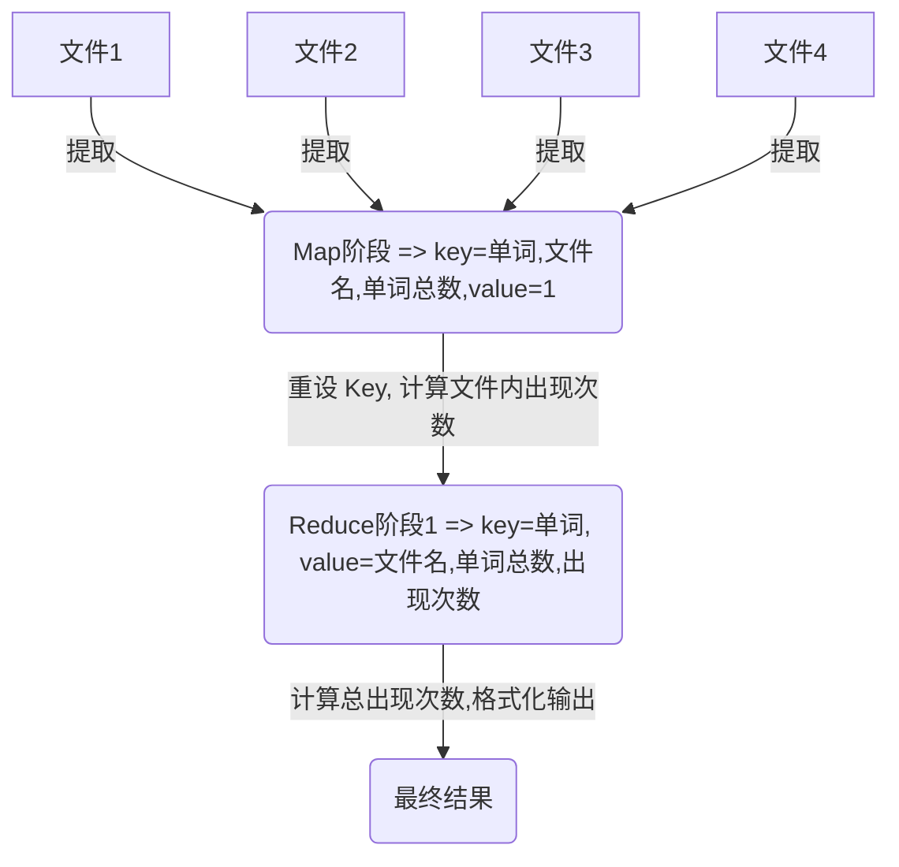

最近在给给女朋友做大数据选修课作业，顺便把之前学的东西往回捡一捡 2333。


## 1. 程序设计伪代码

不太清楚为什么会要求作业报告中包含伪代码，可以跳过直接看第2、3部分～

* Mapper

  将每一行的内容分词，输出 key 为“单词,文件名,单词总数”，输出 value 为“出现次数”

  ```
  // 获取文件名
  fileName = value.getFileName()
  // 从输入中获取所有单词
  words = value.item
  for(word : words){
  	// key = 单词，文件名，单词总数
  	key = word + "," + fileName + "," + words.length()
  	value = 1
  	context.write(key, value)
  }
  ```

* Combiner

  针对每一个输入 key，将 value 值累加，并将 key 中的文章放入 value，输出 key 为“单词”，输出 value 为“文件名,单词总数,出现次数 ….. ”

  ```
  // 先统计同一文件下相同单词的个数
  for(value: values){
  	sum += value
  }
  // 从 key 中取出单词作为下一阶段的 key，把 value 设置为：文件名，单词总数，出现次数
  key = key.subString(0, key.indexOf(","))
  value = key.subString(key.indexOf(",") + "," sum)
  context.write(key, value)
  ```

* Reducer

  针对每一个输入 key，以冒号分割，将 value 值中的出现次数取出来累加，输出 key 为“单词”，输出*value*为“总出现次数:{(文件名，单词总数，出现次数)...}”

  ```
  for(value: values){
  	// 重设 value
    data[3] = value.split(",")
    fileList = "(" + data[0] + "," + data[2] + "," + data[1] + ")"
    // 统计出现总次数
    sum += data[2];
  }
  //总出现次数:{(文件名，单词总数，出现次数)...}
  result = sum + ":{" + fileList.toString() + "}";
  context.write(key, result)
  ```

## 2. 设计思路

map 阶段主要是将文件中的单词根据哈希取出(参考 hadoop 官方提供的 wordcount 例子)

在 reduce 阶段，以单词作为 key ，分两步：

1. 第一步先计算出每个单词在每个文件中出现的次数
2. 第二步计算出该单词在所有文件中出现的次数，并格式化输出内容

难点：

由于 Map 阶段与 wordcount 例子不同，在该阶段计算出的 key 是“单词,文件名,单词总数”，因此在 reduce 阶段需要提取出我们最终的想要的单词作为 key。

再根据单词作为 key 进行混洗，并对 value 进行格式化最终输出。

另外，最终输出时需要自定义 map 输出的分隔符

示意图如下：



## 3. 代码实现

### 3.1 环境说明

* Hadoop ：2.7.7
* Java : 1.8

在数据量不大的情况下，使用单机模式即可，maven 项目的 pom.xml 文件配置如下：

```xml
<?xml version="1.0" encoding="UTF-8"?>
<project xmlns="http://maven.apache.org/POM/4.0.0"
         xmlns:xsi="http://www.w3.org/2001/XMLSchema-instance"
         xsi:schemaLocation="http://maven.apache.org/POM/4.0.0 http://maven.apache.org/xsd/maven-4.0.0.xsd">
    <modelVersion>4.0.0</modelVersion>

    <groupId>com.myhadoop</groupId>
    <artifactId>hadoop</artifactId>
    <version>1.0-SNAPSHOT</version>

    <dependencies>
        <dependency>
            <groupId>org.apache.hadoop</groupId>
            <artifactId>hadoop-core</artifactId>
            <version>1.2.1</version>
        </dependency>

        <dependency>
            <groupId>org.apache.hadoop</groupId>
            <artifactId>hadoop-common</artifactId>
            <version>2.7.7</version>
        </dependency>
    </dependencies>
</project>
```

### 3.2 源代码

```java
import java.io.IOException;
import java.util.StringTokenizer;

import org.apache.hadoop.conf.Configuration;
import org.apache.hadoop.fs.Path;
import org.apache.hadoop.io.Text;
import org.apache.hadoop.mapreduce.Job;
import org.apache.hadoop.mapreduce.Mapper;
import org.apache.hadoop.mapreduce.Reducer;
import org.apache.hadoop.mapreduce.lib.input.FileInputFormat;
import org.apache.hadoop.mapreduce.lib.input.FileSplit;
import org.apache.hadoop.mapreduce.lib.output.FileOutputFormat;

public class WordCount {
    public static class myMapper extends Mapper<Object, Text, Text, Text>
    {
        private Text one = new Text();
        private Text word = new Text();
        public void map(Object key, Text value, Context context) throws IOException, InterruptedException
        {
            FileSplit fileSplit = (FileSplit) context.getInputSplit();
            StringTokenizer itr = new StringTokenizer(value.toString());
            String len = String.valueOf(itr.countTokens());
            while (itr.hasMoreElements()) {
                // 文件名
                String fileName = fileSplit.getPath().getName();
                // 单词，文件名，总单词数
                word.set(itr.nextToken() + "," + fileName + "," + len);
                one.set("1");
                context.write(word, one);
            }
        }
    }

    public static class myCombiner extends Reducer<Text,Text,Text,Text> {
        Text info = new Text();
        public void reduce(Text key, Iterable<Text> values, Context context) throws IOException, InterruptedException {
            int sum = 0;
            for (Text value : values) {
                sum += Integer.parseInt(value.toString());
            }
            int splitIndex = key.toString().indexOf(",");
            info.set(key.toString().substring(splitIndex + 1) + "," + sum);
            //取出单词作为 key
            key.set(key.toString().substring(0, splitIndex));
            context.write(key, info);
        }
    }

    public static class myReducer extends Reducer<Text, Text, Text, Text>
    {
        private Text result = new Text();
        public void reduce(Text key, Iterable<Text> values,Context context) throws IOException, InterruptedException
        {
            StringBuilder fileList = new StringBuilder();
            String[] data;
            int sum =0;
            for (Text value : values)
            {
                data = value.toString().split(",");
                //格式化输出：(文件名，出现次数, 单词总数)
                fileList.append("(").append(data[0]).append(",").append(data[2]).append(",").append(data[1]).append(")");
                // 统计出现总次数
                sum += Integer.parseInt(data[2]);
            }
            //总出现次数:{(文件名，单词总数，出现次数)...}
            result.set(sum + ":{" + fileList.toString() + "}");
            key.set(key.toString());
            context.write(key,result);
        }
    }

    public static void main(String[] args) throws Exception
    {
        Configuration conf = new Configuration();
        // 设置分隔符
        conf.set("mapred.textoutputformat.separator", "->");
        Job job = Job.getInstance(conf, "word count");
        job.setJarByClass(WordCount.class);

        job.setMapperClass(myMapper.class);
        job.setMapOutputKeyClass(Text.class);
        job.setMapOutputValueClass(Text.class);

        job.setCombinerClass(myCombiner.class);

        job.setReducerClass(myReducer.class);
        job.setOutputKeyClass(Text.class);
        job.setOutputValueClass(Text.class);

        FileInputFormat.addInputPath(job, new Path(args[0]));
        FileOutputFormat.setOutputPath(job, new Path(args[1]));

        System.exit(job.waitForCompletion(true) ? 0 : 1);
    }
}
```

### 3.3 输出结果

```
bear->1:{(d2.txt,1,5)}
cat->6:{(d2.txt,3,5)(d1.txt,2,4)(d4.txt,1,5)}
dog->2:{(d1.txt,1,4)(d3.txt,1,3)}
fox->3:{(d3.txt,1,3)(d2.txt,1,5)(d1.txt,1,4)}
hen->1:{(d4.txt,1,5)}
rabbit->1:{(d4.txt,1,5)}
sheep->1:{(d4.txt,1,5)}
wolf->2:{(d4.txt,1,5)(d3.txt,1,3)}
```


